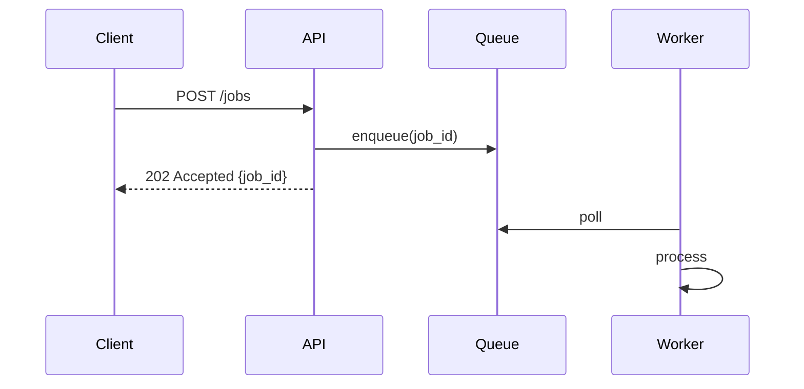
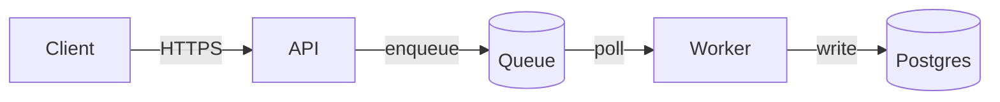

# Documentation sync workflow

Before acting, read the target repository's `CLAUDE.md`, `AGENTS.md`, `CONTRIBUTING.md`, and
relevant `README.md` files. Treat explicit hard rules from the target repository as blockers:
a docs style guide, a "docs live in X" rule, a required page layout, or a banned-word list in
the target repo all win over this file.

You are bringing the human-facing documentation under `./docs` into exact agreement with the
code **as it exists right now**, and leaving it **complete**. Complete means: every user-visible
surface the repo exposes is documented somewhere, every documented claim is traceable to code,
every page is reachable from the nav, every example runs, and the site builds clean.

Two failure modes, in priority order:

1. **Silent drift** — a page that describes last month's behavior. Worse than no page, because
   the reader trusts it.
2. **Silent gaps** — a real surface (a flag, an env var, an endpoint, a failure mode, a required
   permission) that no page mentions, and nobody knows it's missing.

The deliverable is not "I updated the pages the diff touched". It's a docs tree a competent
stranger could use to install, configure, run, operate, extend, and debug this system without
reading the source, plus an explicit report of everything you could not cover and why.

## Voice: write like a human

Binding on every published page. These are read by people, and they're published, so they must
read like a staff engineer wrote them, not like model output.

- Second person, present tense, active voice. "Set `LOG_LEVEL` to `debug`", not "The
  `LOG_LEVEL` variable may be set by the user to the value `debug`".
- Use contractions: "don't", "it's", "there's", "you'll".
- **Never use an em-dash or en-dash ("—", "–") in published prose.** It's the single biggest
  tell. Use a comma, a colon, parentheses, or a full stop and a new sentence.
- Ban outright: "it's worth noting", "in summary", "delve", "leverage", "utilize" (write
  "use"), "let's explore", "furthermore", "additionally", "moreover", "it's important to
  note", "seamlessly", "elevate", "unpack", "meticulously", "dive into", "in today's
  landscape", and "robust" / "comprehensive" / "powerful" as filler adjectives.
- No marketing. A docs page states what the thing does and how to use it. It doesn't sell.
- No throat-clearing intros ("In this guide, we will explore..."). Open with the thing itself.
- Vary sentence length. Short sentence. Then a longer one that carries the detail the reader
  needs to actually do the task.
- Cut trailing boilerplate: "Hopefully this helps", "Feel free to reach out", "Happy coding".
- Never write an attribution footer of any kind ("Generated with...", "Documented by...",
  co-author tags). Nothing in `./docs` says it was written by an agent.
- Say "you" for the reader and name the system by its actual name. Avoid "we" except in
  contributing/decision pages where a team voice is genuine.

Substance beats style. Never drop a required detail (an exact flag name, a default value, an
exit code) to make a sentence flow better. Precision first, voice second.

## Evidence rules: document what the code does, nothing else

- **Every factual claim traces to code you read in this run.** A flag, a default, an env var,
  an endpoint, a status code, a permission, a port, a retry count: you saw it in the source,
  or it doesn't go on the page.
- **Never invent, never extrapolate, never aspire.** No "should", no "will support", no
  documenting the obvious-next-feature. If the code doesn't do it, the docs don't say it.
- **Defaults come from the code, not from the framework's defaults.** Read the actual value.
- **When you can't determine something, say so on the page** ("the retry budget is set by the
  platform and isn't configurable here") or leave it out and list it as a gap in the report.
  Never fill a hole with a plausible guess.
- **Copy exact strings.** Command names, flag spellings, env var names, error text, and JSON
  keys are copied character-for-character from the source, not paraphrased.
- **Anchor pages to their sources.** Every reference and architecture page carries a source
  anchor immediately under its H1 so the next sync can detect staleness mechanically:

  ```markdown
  # CLI reference

  <!-- sources: src/cli/commands.py, src/cli/options.py -->
  ```

  Paths are repo-relative. `scripts/docs-audit.py` compares each page's last-commit time to
  its sources' and flags the page when the code moved on without it.
- **Redact.** Real tokens, keys, internal hostnames, customer names, personal emails, and
  production IPs never go into a published page. Use obvious placeholders
  (`<your-api-token>`, `api.example.com`). The audit script fails the run on credential-shaped
  strings.

## Autonomy and safety

**Run autonomously.** No clarifying questions, no "would you like me to". When intent is
ambiguous, make the best-judgment read from the code, the commit messages, and the PR body,
write against that, and state the assumption in the final report.

**Write the changes, then show them.** Don't ask permission mid-run and don't stop before
writing. Make the edits, build the site, then report the full diff summary and the coverage
table. The user reviews `git diff` before anything is committed.

**Never commit, push, or open a PR unless the invoking agent explicitly asked for it.** The
default end state is a dirty working tree plus a report.

**Deletion is a last resort.** See section 12: a page gets deleted only when the thing it
documents is gone from the code, and every deletion is listed in the report.

Scope hint: whatever the invoking agent supplied (a subsystem, a page, a PR number, "the
session diff"). Empty means "everything that changed since the docs were last in sync, plus a
full gap sweep".

---

## 0. Resolve coordinates

```bash
git rev-parse --show-toplevel                     # repo root; work from here
ls -d docs 2>/dev/null; ls mkdocs.yml 2>/dev/null # the MkDocs happy path
git log -1 --format='%H %cI %s'                   # where HEAD is
git status --short                                # uncommitted work counts as "changed"
```

Detect the docs system before touching anything:

| Signal | System | What to do |
| --- | --- | --- |
| `mkdocs.yml` / `mkdocs.yaml` | MkDocs | The happy path. Follow this file as written. |
| `docusaurus.config.*` | Docusaurus | Follow appendix B, keep the content rules. |
| `conf.py` + `index.rst` | Sphinx | Follow appendix B, keep the content rules. |
| `docs/` with no config | Plain Markdown | Scaffold MkDocs (section 10) unless the repo's own rules say otherwise. |
| No `docs/` at all | Nothing yet | Scaffold from scratch (section 10). |
| `README.md` only, tiny repo | Single-page | Still do the sweep. If the repo is genuinely one file of code, deepen the README instead of scaffolding a site, and say so. |

Also resolve the **change window**: what "recent" means for this run.

```bash
DEFAULT_BRANCH=$(git symbolic-ref --quiet --short refs/remotes/origin/HEAD 2>/dev/null | sed 's#^origin/##' || echo main)
git log --oneline -n 30
git diff --stat "origin/$DEFAULT_BRANCH"...HEAD    # branch work
git diff --stat                                    # uncommitted
git log -1 --format=%cI -- docs mkdocs.yml         # when docs were last touched at all
git log --oneline "$(git log -1 --format=%H -- docs)..HEAD" -- . ':!docs' ':!*.md'
```

That last command is the honest change window: every code commit since the docs were last
touched. Use it, not "the last 20 commits", when the docs have been neglected.

---

## 1. Inventory what changed

Read the diff for **meaning**, not for line count. For each changed file, decide which reader
it affects: someone installing, someone calling the API, someone operating it in production,
someone extending it, or nobody (a pure internal refactor).

```bash
git diff "origin/$DEFAULT_BRANCH"...HEAD --stat
git diff "origin/$DEFAULT_BRANCH"...HEAD -- <path>          # read the ones that matter
gh pr view --json title,body,files 2>/dev/null || true      # intent, when there's a PR
```

Classify every change into one of:

- **User-visible behavior** — always documented. New/changed endpoint, flag, env var, default,
  output format, error, permission, limit.
- **Setup or operations** — always documented. New dependency, new service, new migration, new
  required secret, changed port, changed deploy step.
- **Architecture** — documented when it changes a boundary, a data flow, or a decision.
- **Internal only** — a refactor with identical behavior. Not documented, but **check whether
  an existing page names the moved symbol or old path** and fix those references.

A rename is user-visible. A default that changed value is user-visible and needs a note about
the old value. A removed flag is user-visible and needs a deprecation note, not silent deletion.

---

## 2. Sweep the code for every documentable surface

This is the step that makes the difference between "docs got updated" and "no stone unturned".
Do it on every run, not just when the diff looks big. The diff tells you what's newly wrong;
this sweep tells you what was never right.

Work the checklist below. For each row: find it in the code, note where it's documented, and
record the status. Rows that genuinely don't apply get marked `n/a` **with a reason** in the
report. Nothing gets skipped silently.

### 2a. Surface checklist

| # | Surface | Reader question it answers |
| --- | --- | --- |
| 1 | Purpose, scope, non-goals | What is this, who is it for, what does it deliberately not do? |
| 2 | Install / obtain | How do I get it (package, image, binary, module, marketplace)? |
| 3 | Prerequisites | What runtime, tool versions, accounts, and hardware do I need? |
| 4 | Quickstart | What's the shortest path to first success? |
| 5 | Configuration | Every env var, config key, and file: type, default, required?, effect, precedence. |
| 6 | CLI surface | Every command, subcommand, flag, argument, exit code, and output format. |
| 7 | HTTP / RPC API | Every route: method, path, auth, params, body, all responses, errors, limits. |
| 8 | Library / public API | Every exported symbol, its signature, and its stability guarantee. |
| 9 | Data model | Tables/collections, fields, types, relationships, indexes, migrations. |
| 10 | Async surface | Queues, topics, webhooks, cron/scheduled jobs, retries, idempotency, ordering. |
| 11 | Auth & permissions | Identity model, roles, scopes, token lifetimes, what each endpoint requires. |
| 12 | Architecture | Components, boundaries, data flow, external dependencies, sync vs async. |
| 13 | Deployment | Environments, IaC, pipelines, promotion, rollback, required platform config. |
| 14 | Observability | Health checks, metrics, log format and fields, traces, alerts, dashboards, SLOs. |
| 15 | Runbooks | Backup/restore, DR, incident recovery, scaling, credential rotation. |
| 16 | Troubleshooting | Symptom, cause, fix. One entry per error a user can actually hit. |
| 17 | Limits & performance | Quotas, timeouts, concurrency, payload caps, known bottlenecks, cost drivers. |
| 18 | Security posture | Secret handling, TLS, CORS, dependency policy, how to report a vulnerability. |
| 19 | Compatibility & versioning | Semver policy, supported versions matrix, deprecation windows. |
| 20 | Upgrade / migration | How to move from version N to N+1, including data migrations and breaks. |
| 21 | Local development | Setup, run, test, lint, build, seed data, common tasks. |
| 22 | Contributing | Branch and commit conventions, review process, release process. |
| 23 | Extension points | Plugins, hooks, templates, custom providers, and their contracts. |
| 24 | Integrations | Third-party services, required credentials, setup steps per integration. |
| 25 | Decisions | ADRs, tradeoffs taken, alternatives rejected and why. |
| 26 | Glossary | Every domain term the code uses that a newcomer wouldn't know. |
| 27 | FAQ | The questions the issue tracker keeps repeating. |
| 28 | Known limitations | What it can't do today, and the workaround if there is one. |
| 29 | License & third-party notices | What the license permits, and what's vendored. |
| 30 | Changelog | What changed per release, in reader-facing terms. |

### 2b. Discovery recipes

Use `rg` when present, else `grep -rn`. Adapt patterns to the stack in front of you; these are
starting points, not an exhaustive grammar.

**Entry points and surfaces**

```bash
rg -n '^(def main|if __name__|func main\(|export default|module.exports)' --glob '!**/test*'
rg -n 'FastAPI\(|Flask\(|express\(|Hono\(|http.HandleFunc|createServer' 
fd -H -t f 'Dockerfile|docker-bake.hcl|Procfile|main.tf|wrangler.jsonc|serverless.yml' 2>/dev/null
```

**HTTP routes**

```bash
rg -n '@(app|router|api)\.(get|post|put|patch|delete)\(' -g '*.py'
rg -n '(app|router)\.(get|post|put|patch|delete)\(' -g '*.ts' -g '*.js'
rg -n 'path\("|re_path\(|urlpatterns' -g '*.py'          # Django
rg --files -g 'app/**/route.ts' -g 'pages/api/**'         # Next.js
```

**CLI surface**

```bash
rg -n 'add_argument\(|@click\.(command|option|argument)|typer\.|cobra\.Command|new Command\('
# then confirm against reality:
<the-cli> --help
<the-cli> <subcommand> --help
```

**Configuration and env vars** (the most commonly under-documented surface)

```bash
# no -o on the first pass: it would print the matched call, not the variable name
rg -n 'os\.environ|os\.getenv|process\.env|Deno\.env|getenv\(' --no-filename \
  | rg -o '[A-Z][A-Z0-9_]{2,}' | sort -u    # over-captures assignment targets; skim it
rg -n 'BaseSettings|pydantic_settings|Field\(.*env=|z\.object\(' 
cat .env.example .env.sample 2>/dev/null
rg -n '^\s*[A-Z_]+:' docker-compose*.yml 2>/dev/null
rg -n 'variable "' -g '*.tf'                              # Terraform inputs
rg -n '^\s*\w+:' values.yaml 2>/dev/null                  # Helm values
```

Cross-check both directions: every env var in the code appears in the docs, and every env var
in the docs still exists in the code. A documented variable that no longer exists is a bug
report waiting to happen.

**Data model and migrations**

```bash
rg -n 'class .*\((Base|Model|models\.Model)\)|__tablename__' -g '*.py'
rg -n 'pgTable\(|createTable|defineTable' -g '*.ts'
fd -t f . migrations alembic/versions prisma 2>/dev/null | tail -20
```

**Async, scheduled, and event surfaces**

```bash
rg -n '@(celery|shared_task|cron|scheduled)|schedule\(|cron:|BullMQ|Queue\(|publish\(|subscribe\('
rg -n 'on:\s*$|schedule:' .github/workflows/*.yml
rg -n 'crons\s*=|\[triggers\]' wrangler.jsonc wrangler.toml 2>/dev/null
```

**Auth, permissions, and secrets**

```bash
rg -n 'Depends\(|require_auth|@login_required|authorize|has_permission|scope|RBAC|IAM'
rg -n 'secrets\.|SecretStr|vault|1password|op read|SOPS'
```

**Errors the user can hit**

```bash
rg -n 'raise \w+Error\(|HTTPException\(|throw new \w+Error\(|status_code=[45]' 
```

Every distinct user-facing error message becomes a troubleshooting entry: what it means, what
causes it, what to do.

**Build, test, and task surface**

```bash
cat Makefile justfile 2>/dev/null | rg -n '^[a-z].*:'
rg -n '"scripts"' -A 20 package.json 2>/dev/null
rg -n '\[tool\.|\[project\.scripts\]' pyproject.toml 2>/dev/null
rg -n 'tasks|pipeline' turbo.json 2>/dev/null
rg --files .github/workflows
```

**Version and platform support**

```bash
cat mise.toml .tool-versions .nvmrc 2>/dev/null
rg -n 'requires-python|"engines"|go 1\.|rust-version'
```

**Observability**

```bash
rg -n 'logger\.|structlog|getLogger|console\.(log|error)' -l | head
rg -n 'Counter\(|Histogram\(|metrics\.|trace\.|span|OpenTelemetry|prometheus'
rg -n '/health|/healthz|/readyz|/metrics'
```

For anything the sweep surfaces that you can't judge from a grep hit alone, **read the file**.
A grep tells you a thing exists; only the source tells you what it does and what its default is.

---

## 3. Inventory the existing docs

```bash
find docs -name '*.md' | sort                              # every page (portable, all depths)
for f in $(find docs -name '*.md'); do echo "$(wc -w < "$f") $f"; done | sort -n | head
git log -1 --format='%cI %s' -- docs
for f in $(find docs -name '*.md'); do echo "$(git log -1 --format=%cs -- "$f") $f"; done | sort
```

Use `find`, not `docs/**/*.md`: bash without `globstar` silently expands `**` to a single
level, so the top-level pages never make it into the list and you'd audit a subset while
believing you covered everything.

That last loop gives you a page-by-page staleness ranking. Anything untouched for months while
its subsystem shipped features is a prime suspect.

Then run the audit script for the mechanical findings (broken links, orphans, dead anchors,
stale source anchors, stubs, leaked credentials, voice violations). Locate it at the first of
these paths that exists, same resolution order as this file:

1. `${CLAUDE_PLUGIN_ROOT}/scripts/docs-audit.py` — installed as a plugin
2. `.claude/scripts/docs-audit.py` — headless runs
3. `scripts/docs-audit.py` — working inside the agent-skills checkout

```bash
python3 "$DOCS_AUDIT" audit --root . --output .git/docs-audit.json
python3 "$DOCS_AUDIT" audit --root . --quiet          # human-readable, hides info level
```

If it isn't present or `python3` isn't available, do the same checks by hand: every nav entry
resolves to a file, every file appears in nav, every relative link resolves, no page is a stub.
Say in the report that the audit ran by hand.

---

## 4. Build the coverage matrix

Join sections 2 and 3 into one table. This is the artifact that proves nothing was skipped, and
it goes in the final report.

| Surface | Where it lives in code | Documented at | Status |
| --- | --- | --- | --- |
| Configuration | `src/settings.py` | `reference/configuration.md` | updated: 3 new vars |
| CLI | `src/cli/*.py` | `reference/cli.md` | stale: `--dry-run` undocumented |
| Webhooks | `src/webhooks/` | nowhere | **gap: page created** |
| Runbooks | n/a | n/a | n/a: library, nothing to operate |

Status is one of: `current` (verified, no change needed), `updated`, `created`, `gap` (real,
not covered this run, with a reason), or `n/a` (with a reason). Every one of the 30 rows in
section 2a gets a verdict. "I didn't look" is not a verdict.

Work the gaps in this order: **wrong** beats **missing** beats **thin**. A page that lies to
the reader is the first thing you fix.

---

## 5. Documentation architecture

Organize by what the reader is trying to do (the Diátaxis split), not by how the code is
packaged. Four modes, and never mix them on one page:

- **Tutorial** — learning-oriented. A guided first success. Assumes nothing.
- **How-to guide** — task-oriented. "How do I rotate the signing key?" Assumes competence.
- **Reference** — information-oriented. Exhaustive, dry, scannable, alphabetical or structured.
- **Explanation** — understanding-oriented. Why the architecture is like this, what tradeoffs.

The canonical tree. Include what applies, skip what doesn't, and say which you skipped and why.

```text
docs/
├── index.md                     # what it is, who it's for, non-goals, 60-second value
├── getting-started/
│   ├── prerequisites.md         # versions, accounts, tools, hardware
│   ├── installation.md          # every install path that actually works
│   └── quickstart.md            # shortest path to a verified first success
├── guides/                      # one task per page, imperative titles
│   ├── <task>.md
│   └── ...
├── reference/
│   ├── configuration.md         # every env var and config key
│   ├── cli.md                   # every command and flag
│   ├── api.md                   # every endpoint (or an OpenAPI embed)
│   ├── data-model.md            # schema, relationships, migrations
│   ├── errors.md                # every user-facing error, cause, fix
│   └── limits.md                # quotas, timeouts, payload caps
├── architecture/
│   ├── overview.md              # components + a diagram
│   ├── data-flow.md             # request/event lifecycles
│   └── decisions/               # ADRs, one per file, never edited after acceptance
├── operations/
│   ├── deployment.md            # environments, pipeline, promotion, rollback
│   ├── configuration.md         # per-environment settings and secrets handling
│   ├── observability.md         # metrics, logs, traces, alerts, dashboards
│   ├── runbooks.md              # backup/restore, DR, rotation, scaling
│   └── troubleshooting.md       # symptom → cause → fix
├── contributing/
│   ├── development.md           # local setup, tests, lint, build
│   └── releasing.md             # version policy, release process
├── security.md                  # posture, secret handling, vulnerability reporting
├── faq.md
├── glossary.md
└── changelog.md                 # or a link to GitHub Releases
```

Rules that hold whatever the tree looks like:

- **One page per job.** If a page answers two unrelated questions, split it.
- **Every page is reachable from the nav.** No orphans, ever.
- **Cross-link forward and back.** A guide links to the reference entries it uses; a reference
  entry links to the guide that shows it in context. Aim for at least two outbound links per
  page and no page with zero inbound links.
- **Don't duplicate.** State a fact once, link to it everywhere else. Duplicated facts drift.
- **Depth over breadth.** Ten thorough pages beat forty stubs. A stub is a broken promise.

---

## 6. What "complete" means, per item

This is where "no stone unturned" gets enforced at the item level. A page isn't done because
the topic has a heading. It's done when each item on it carries everything below.

**Every configuration key / env var:**
name, type, required or optional, default value (the real one, from code), what it changes,
valid range or enum, an example value, precedence relative to other sources, when it's read
(boot vs per-request), and whether it's a secret. Table form, one row per key.

**Every CLI command:**
synopsis line, one-sentence purpose, every flag with type and default, positional arguments,
at least one runnable example with its real output, exit codes and what they mean, and the
side effects it has.

**Every endpoint:**
method and path, auth and required scope, path/query/body parameters with types and whether
they're required, a full request example, a full success response example, every non-2xx status
it can return and why, pagination, rate limits, and idempotency behavior.

**Every guide:**
what you'll have at the end, prerequisites, numbered steps that are literally runnable, expected
output after the steps that matter, how to verify it worked, how to undo it, and a pointer to
the troubleshooting entries for the ways it commonly fails.

**Every error entry:**
the exact message string as it appears, what triggers it, how to confirm that's the cause, the
fix, and the link to the relevant reference page.

**Every architecture page:**
a diagram, the components and their responsibilities, the boundaries (what talks to what, over
what protocol, synchronously or not), the failure modes at each boundary, and the tradeoff that
was accepted.

**Every code example:**
complete enough to paste and run, with the imports and setup it needs, real values or obvious
placeholders (never `foo`/`bar` when a domain term exists), a language tag on the fence, and
verified working (section 11).

---

## 7. Diagrams

A diagram earns its place when the relationship is hard to hold in prose: component
boundaries, request lifecycles, state machines, data models. Use Mermaid so it lives in Git
and renders natively in MkDocs Material and GitHub.

````markdown

````

- Architecture overview: a `flowchart` of components with the protocol on each edge.
- Request or event lifecycle: a `sequenceDiagram`.
- Data model: an `erDiagram` mirroring the actual schema, field names included.
- Lifecycle with states: a `stateDiagram-v2`.
- Deployment topology: a `flowchart` grouped with `subgraph` per environment or per boundary.

Label every edge (protocol, direction, sync/async). An unlabeled arrow tells the reader
nothing. Keep one diagram to one idea; two diagrams beat one crowded one. Mermaid needs the
superfences config from appendix A to render.

---

## 8. Write the pages

Order of work: fix wrong pages, then fill gaps, then deepen thin pages, then polish.

- **Edit surgically.** Change the sentences that are wrong. Don't rewrite a page a human wrote
  just to restyle it. Big cosmetic diffs bury the real change and lose the author's voice.
- **Preserve human prose.** If an existing explanation is correct, keep it, even if you'd have
  phrased it differently.
- **Lead with the answer.** The reader is looking for the command. Put it near the top.
- **Tables for anything enumerable.** Config keys, flags, status codes, roles, limits. Prose
  hides items; tables let a reader confirm coverage at a glance.
- **Admonitions carry weight, so ration them.** `!!! warning` for data loss or a security
  footgun, `!!! note` for a real caveat, `!!! tip` sparingly. A page of admonitions is a page
  of noise.

  ```markdown
  !!! warning "This deletes data"
      `reset --hard` drops the local database. Take a dump first: `pg_dump ...`
  ```

- **Tabs for genuine alternatives** (macOS vs Linux, npm vs pnpm, curl vs SDK):

  ````markdown
  === "pnpm"
      ```bash
      pnpm install
      ```
  === "npm"
      ```bash
      npm install
      ```
  ````

- **Every fence gets a language tag.** `bash`, `python`, `json`, `yaml`, `hcl`, `text`.
- **Commands are copy-pasteable.** No leading `$`, no interleaved output inside the fence. Show
  output in a separate fence tagged `text` when it matters.
- **Relative Markdown links between pages** (`../reference/cli.md`), never site-absolute paths.
  MkDocs rewrites them and validates them in strict mode.
- **Deprecations are announced, not deleted.** When a flag or endpoint goes away, keep the entry
  with a `!!! warning "Removed in vX.Y"` and a pointer to the replacement.
- **Note version boundaries** on anything that changed behavior: "since v2.3", "removed in v3".

---

## 9. Keep `mkdocs.yml` in sync

Every page created gets a nav entry. Every page deleted comes out of nav. Nav order follows the
reader's journey: index, getting started, guides, reference, architecture, operations,
contributing, then the standalone pages.

```yaml
nav:
  - Home: index.md
  - Getting started:
      - Prerequisites: getting-started/prerequisites.md
      - Installation: getting-started/installation.md
      - Quickstart: getting-started/quickstart.md
  - Guides:
      - Rotate credentials: guides/rotate-credentials.md
  - Reference:
      - Configuration: reference/configuration.md
      - CLI: reference/cli.md
      - Errors: reference/errors.md
```

Nav titles are short and reader-facing ("Rotate credentials", not "Credential rotation guide
for operators"). Section names are nouns; page titles under Guides are imperative verbs. The
nav title should match the page's H1 unless the H1 needs to be longer for SEO.

---

## 10. Scaffold from scratch

Only when `./docs` or `mkdocs.yml` is missing. Create the config in appendix A, then create
`index.md`, `getting-started/quickstart.md`, and `architecture/overview.md` **with real
content from the sweep in section 2**, not placeholder text. A scaffold full of TODOs is worse
than no scaffold, and the audit script fails on it.

Then:

```bash
rg -q '^/site/?$|^site/$' .gitignore || printf 'site/\n' >> .gitignore
```

Add the remaining pages the coverage matrix says the repo needs, in the priority order from
section 4. If the repo is genuinely too small to justify a site (one script, no public API),
say so, improve the README instead, and explain the call in the report.

---

## 11. Verify

Nothing ships unverified. Run every check that applies and report the result of each.

**a) The site builds, strictly.** Strict mode turns broken internal links and nav problems into
build failures, which is exactly what you want.

```bash
mkdocs build --strict 2>&1 | tail -30
# no mkdocs on PATH? try, in order:
python3 -m mkdocs build --strict
uvx --with mkdocs-material mkdocs build --strict
uv run mkdocs build --strict
```

If MkDocs or `mkdocs-material` isn't installed and you can't install it cleanly, say exactly
that in the report (naming the missing dependency and the install command), and run the audit
script instead. Don't silently skip the build, and don't add a dependency to the repo to make
a build work.

**b) The audit passes.**

```bash
python3 "$DOCS_AUDIT" audit --root . --strict
```

Fix every error-level finding. Justify any warning you leave in the report.

**c) Examples actually run.** For each documented command, run it (or its `--help`) and diff
the real behavior against the page. Prefer read-only invocations; never run a documented
command that mutates production, deletes data, or spends money. State which examples you
verified and which you reasoned about statically.

```bash
<the-cli> --help                         # flags match reference/cli.md?
curl -s localhost:8000/openapi.json | python3 -m json.tool | head -50
```

**d) Config coverage is bidirectional.**

```bash
# in the code but not in the docs: undocumented settings
comm -23 <(rg -o 'os\.environ\[.([A-Z_]+)|getenv\(.([A-Z_]+)' -r '${1}${2}' -N --no-filename src | sort -u) \
         <(rg -o '[A-Z][A-Z0-9_]{2,}' -N --no-filename docs | sort -u)

# in the docs but not in the code: settings that no longer exist
comm -13 <(rg -o 'os\.environ\[.([A-Z_]+)|getenv\(.([A-Z_]+)' -r '${1}${2}' -N --no-filename src | sort -u) \
         <(rg -o '[A-Z][A-Z0-9_]{2,}' -N --no-filename docs/reference | sort -u)
```

Both directions matter, and both need a skim: the right-hand side picks up acronyms and
headings that aren't settings at all. Adjust the extraction pattern to the stack (`process.env.X`,
`Deno.env.get("X")`, `variable "x"` in Terraform) rather than trusting one regex everywhere.

Anything the left side has and the right side doesn't is an undocumented setting. Run the
reverse to find documented settings that no longer exist.

**e) Nothing leaked.** The audit script's `secrets` check must be clean, and skim any diff hunk
that added a URL, a hostname, or an ID.

**f) Links out to other repos and vendor docs resolve.** Spot-check the ones you added.

---

## 12. Deletions, moves, and deprecations

- **Delete a page only when the thing it documents is gone from the code.** Confirm with a grep
  before removing anything, and list every deletion in the report with the evidence.
- **Never delete a human-written page because it's "redundant"** with something you wrote.
  Merge the content, then delete, and say so.
- **Moves keep their old URL alive.** If the site is published and a page moves, add a redirect
  rather than breaking every existing link:

  ```yaml
  plugins:
    - redirects:
        redirect_maps:
          old/path.md: new/path.md
  ```

  If `mkdocs-redirects` isn't already a dependency, don't add it: leave a one-line stub page at
  the old path pointing to the new one, and flag the option in the report.
- **A removed feature gets a deprecation note, not silence.** The reader who lands on the page
  from an old bookmark needs to know where the thing went.

---

## 13. Adjacent surfaces

`./docs` is the deliverable, but these drift alongside it. Fix the ones that are the canonical
source of a fact you documented, and flag the rest rather than expanding scope silently.

| Surface | Rule |
| --- | --- |
| `README.md` | Keep it short: what it is, install, quickstart, link into `./docs`. Move depth into docs rather than duplicating it. Fix outright wrong statements. |
| `.env.example` | Must list every env var the code reads, with a safe placeholder. Update it when the sweep finds a gap. |
| CLI `--help` text | The reference page mirrors it. When they disagree, the code is right and the docs change, unless the help text itself is plainly wrong: then flag it. |
| OpenAPI / schema files | Generated ones are the source of truth for `reference/api.md`. Don't hand-edit generated output. |
| `CHANGELOG.md` | If release notes are automated (semantic-release, gitversion), don't hand-write entries. Link to Releases instead. |
| Docstrings / code comments | Out of scope for a docs sync. Flag ones that contradict the docs. |
| `CONTRIBUTING.md` | Owns process. `docs/contributing/` covers mechanics. Link, don't duplicate. |

---

## 14. Publishing

Only if the repo already publishes docs, or the invoking agent asked for it. Report the option
rather than acting when it means adding CI.

- A docs build in CI catches drift on the PR that causes it. If the repo has no docs job, note
  it as a follow-up with the exact job to add: `mkdocs build --strict`.
- Deploy via whatever the repo already uses (`mkdocs gh-deploy`, a Pages workflow, a container).
  Don't introduce a new publishing mechanism in a docs-sync run.
- Versioned docs (`mike`) matter for a published library with supported older versions. Mention
  it as a follow-up if the repo ships versions and the docs only describe `main`.

---

## 15. Report back

End with a report that makes coverage auditable. No silent truncation, ever.

1. **What changed, and why.** Per page: created / updated / deleted, and the code change or gap
   that drove it. Keep it to a line each.
2. **The coverage matrix** from section 4, all 30 surfaces, each with a status and a reason for
   every `gap` and `n/a`. This is the centrepiece: it's what proves the sweep happened.
3. **Verification results.** The `mkdocs build --strict` outcome (warnings quoted verbatim), the
   audit script's counts, which examples you ran versus reasoned about, and anything you
   couldn't check with the exact reason (missing dependency, needs prod credentials, mutating
   command).
4. **Assumptions.** Every place the code was ambiguous and you made a judgment call, so a human
   can correct it.
5. **Gaps and follow-ups**, ordered by reader impact. Include what you'd document next and what
   needs a human (a product decision, a diagram of a system you can't see, an internal runbook).
6. **The nav diff**, so the structure change is reviewable at a glance.
7. **State plainly that nothing was committed** and that the working tree is dirty for review.

Then stop. Don't commit, don't push, don't open a PR unless you were asked to.

---

## Appendix A: reference `mkdocs.yml`

Scaffold with this. Trim what the repo doesn't need; keep `strict`, the superfences/mermaid
block, and `toc.permalink`.

```yaml
site_name: <Project>
site_description: <one line, the same one used in the repo description>
repo_url: https://github.com/<org>/<repo>
edit_uri: edit/main/docs/
strict: true

theme:
  name: material
  features:
    - navigation.tabs
    - navigation.sections
    - navigation.top
    - navigation.instant
    - toc.follow
    - content.code.copy
    - content.tabs.link
    - search.suggest
    - search.highlight
  palette:
    - media: "(prefers-color-scheme: light)"
      scheme: default
      toggle: { icon: material/brightness-7, name: Switch to dark mode }
    - media: "(prefers-color-scheme: dark)"
      scheme: slate
      toggle: { icon: material/brightness-4, name: Switch to light mode }

markdown_extensions:
  - admonition
  - attr_list
  - md_in_html
  - tables
  - footnotes
  - pymdownx.details
  - pymdownx.highlight: { anchor_linenums: true }
  - pymdownx.inlinehilite
  - pymdownx.snippets
  - pymdownx.tabbed: { alternate_style: true }
  - pymdownx.superfences:
      custom_fences:
        - name: mermaid
          class: mermaid
          format: !!python/name:pymdownx.superfences.fence_code_format
  - toc: { permalink: true }

plugins:
  - search

nav:
  - Home: index.md
```

`strict: true` makes broken internal links fail the build, which is the point. Requires
`mkdocs-material` (`pip install mkdocs-material`, `uv add --dev mkdocs-material`, or run it
throwaway with `uvx --with mkdocs-material mkdocs build --strict`).

---

## Appendix B: other docs systems

Everything above about **content** holds. Only the mechanics change.

- **Docusaurus** — pages under `docs/`, nav in `sidebars.*`, admonitions are `:::warning`,
  build with `npm run build` (fails on broken links by default). Keep the source-anchor
  comments; they work the same.
- **Sphinx** — Markdown needs MyST; nav is `toctree` directives, not a nav key. Build with
  `sphinx-build -W` for strict. The audit script's link and nav checks assume MkDocs, so run
  them with `--docs <dir>` and treat nav findings as advisory.
- **Plain Markdown, no site** — keep the same tree under `docs/`, and maintain `docs/index.md`
  as a hand-written index since there's no nav to generate. Cross-links matter more, not less.
- **A docs site in a different repo** — do the sweep, write the pages in this repo's `./docs`
  only if that's where they belong. Otherwise report the gaps and where they need to land.

---

## Appendix C: page skeletons

**Reference page**

```markdown
# Configuration

<!-- sources: src/settings.py, .env.example -->

Every setting the service reads at boot. Values come from the environment first, then
`config.toml`, then the built-in defaults.

## Environment variables

| Variable | Type | Default | Required | Description |
| --- | --- | --- | --- | --- |
| `DATABASE_URL` | string | none | yes | Postgres DSN. Must use the `postgresql+psycopg://` scheme. |
| `LOG_LEVEL` | enum | `info` | no | One of `debug`, `info`, `warning`, `error`. |

## Precedence

...
```

**How-to guide**

````markdown
# Rotate the signing key

Replaces the active signing key without dropping in-flight requests. Takes about five minutes.

## Before you start

- Admin access to the secrets store
- The service running on v2.4 or later

## Steps

1. Generate the new key:

   ```bash
   <command>
   ```

2. ...

## Verify

```bash
<command>
```

You should see `active_key_id` change to the new value.

## If something goes wrong

The old key stays valid for 24 hours, so roll back by ...
````

**Architecture page**

````markdown
# Overview

<!-- sources: src/api, src/worker, infra/main.tf -->

Three components: an API that accepts work, a queue that buffers it, and workers that drain it.



## Components

### API
Responsibility, what it owns, what it never does.

## Boundaries and failure modes

| Boundary | Protocol | Failure mode | Behavior |
| --- | --- | --- | --- |
| API to Queue | AMQP | queue unreachable | request fails with 503, nothing is persisted |
````
