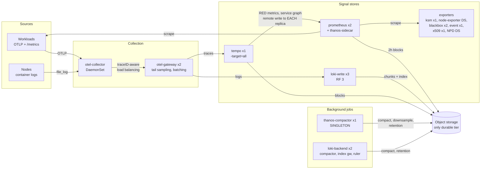
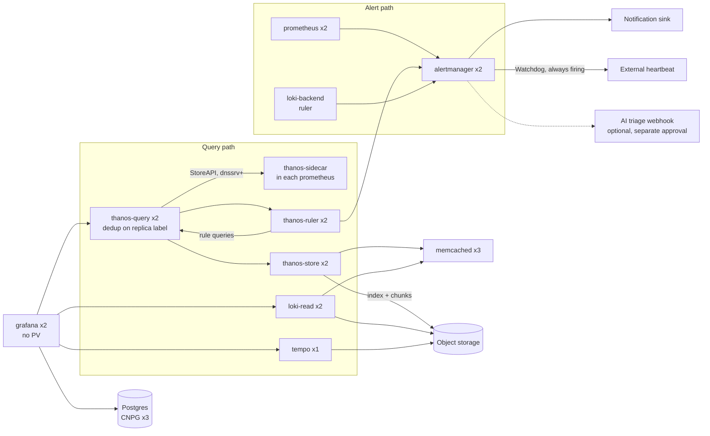

# Reference architecture

One fixed architecture for metrics, logs and traces. Object storage and the notification sink
plug in (see `backends.md`); nothing else about the shape changes when they do.

## Contents

- [Components](#components)
- [Data flow](#data-flow)
- [Scaling to the node count](#scaling-to-the-node-count)
- [Namespaces and placement](#namespaces-and-placement)
- [Adapting an existing stack](#adapting-an-existing-stack)
- [Optional components](#optional-components)
- [Where the charts and images come from](#where-the-charts-and-images-come-from)

## Components

Replica counts assume at least three schedulable nodes in the pool the stack runs on. See
[Scaling to the node count](#scaling-to-the-node-count) before generating for fewer.

### Metrics

| Component | Kind | Replicas | PV | Notes |
| --- | --- | --- | --- | --- |
| prometheus | StatefulSet | 2 | 50Gi | kube-prometheus-stack. Working state only, see `storage-model.md` |
| thanos-sidecar | container | per Prometheus pod | none | Uploads 2h blocks, serves fresh data over StoreAPI |
| thanos-query | Deployment | 2 | none | Deduplicates on the Prometheus replica label |
| thanos-store | StatefulSet | 2 | 50Gi | Index-header cache |
| thanos-compactor | StatefulSet | 1 | 100Gi | **Singleton per bucket.** Invariant 1 |
| thanos-ruler | StatefulSet | 2 | 10Gi | Rules that need history beyond local retention |
| alertmanager | StatefulSet | 2 | 1Gi | Gossip cluster, nflog and silences |
| kube-state-metrics | Deployment | 1 | none | Or sharded. Invariant 5 |
| node-exporter | DaemonSet | per node | none | |
| blackbox-exporter | Deployment | 2 | none | Stateless prober |

### Logs

| Component | Kind | Replicas | PV | Notes |
| --- | --- | --- | --- | --- |
| loki-write | StatefulSet | 3 | 10Gi | `replication_factor: 3`, WAL only |
| loki-read | Deployment | 2 | none | Querier and query frontend |
| loki-backend | StatefulSet | 2 | 10Gi | Compactor, ruler, index gateway, query scheduler |

This is Loki's simple scalable deployment (SSD). Loki 3.x deprecates it, and Loki 4.0 removes it,
in favour of the distributed (microservices) mode or a replicated monolithic mode. It is still the
supported middle ground on 3.x, so the reference keeps it. Say in the output README that moving off
it is required before Loki 4.0, and set `deploymentMode: SimpleScalable` explicitly, because the
chart's default is now `Monolithic`.

### Traces

| Component | Kind | Replicas | PV | Notes |
| --- | --- | --- | --- | --- |
| tempo | StatefulSet | 1 | 10Gi | Monolithic, `-target=all`. Invariant 9: Tempo 3.x does not support more than one monolithic instance |

The reference originally called for 3 Tempo replicas. On Tempo 3.x that is unsupported, so the
reference is 1 until invariant 9's check says otherwise. HA tracing on 3.x means the distributed
chart with a Kafka-compatible log, which is a different architecture: raise it with the user rather
than generating it silently.

### Collection

| Component | Kind | Replicas | Notes |
| --- | --- | --- | --- |
| otel-collector | DaemonSet | per node | OTLP receiver, `k8s_attributes`, `file_log` (invariant 16) |
| otel-gateway | Deployment | 2 | Tail sampling, batching, egress to Tempo and Loki (invariant 15) |

### Presentation

| Component | Kind | Replicas | Notes |
| --- | --- | --- | --- |
| grafana | Deployment | 2 | No PV. External Postgres (a CloudNativePG cluster of 3). Invariant 12 |

### Shared

| Component | Kind | Replicas | Notes |
| --- | --- | --- | --- |
| memcached | Deployment | 3 | Loki chunk and results caches, Thanos store index cache and caching bucket |

### Supporting exporters

| Component | Kind | Replicas | Notes |
| --- | --- | --- | --- |
| kubernetes-event-exporter | Deployment | 1 | **Single replica.** Leader election is off by default. Invariant 6. Its last release (v1.7) is from February 2024; check the project is alive, or use a single-replica collector with the Kubernetes events or objects receiver instead |
| x509-certificate-exporter | Deployment | 1 | Certificates in Secrets. No host-path DaemonSets; self-managed API server certificates are probed over TLS (distros.md) |
| node-problem-detector | DaemonSet | per node | Kernel and runtime problems as node conditions and metrics |

### Operators

Assume these exist, or install them first:

- prometheus-operator (ships inside kube-prometheus-stack).
- opentelemetry-operator, only if the collectors are rendered as `OpenTelemetryCollector` custom
  resources or auto-instrumentation is wanted. The collector Helm chart needs no operator. Pick the
  chart when the GitOps layout cannot apply the operator's CRDs before the custom resources (see
  `output.md`, CRD ordering).
- CloudNativePG, for Grafana's database, unless an external Postgres already exists.

## Data flow

### Write path

### Read and alert path

Things the diagrams encode that are easy to get wrong:

- Grafana's metrics datasource is **thanos-query**, not a Prometheus Service. A Service in front
  of two Prometheus replicas load-balances between two slightly different datasets and shows
  flapping graphs. Thanos Query deduplicates them.
- Anything that remote-writes into Prometheus (Tempo's metrics-generator, the gateway's metrics
  pipeline) writes to **each replica by pod DNS name**. Invariant 13.
- The compactor is not on the query path. It can be down for hours without anyone noticing in
  Grafana, which is why it needs its own alerts (`validation.md`).
- Every alert source (Prometheus, Thanos Ruler, Loki ruler, Grafana-managed alerts if used) sends
  to the same Alertmanager cluster, so routing, inhibition and the Watchdog live in one place.

## Scaling to the node count

Replicas above assume three or more schedulable nodes in the pool. Required anti-affinity on
`kubernetes.io/hostname` (invariant 10) means a component can never run more replicas than there
are nodes, and a rollout or drain needs one node of headroom.

| Nodes in pool | What to generate | Warn about |
| --- | --- | --- |
| 3 or more | Reference replicas | With exactly 3, draining one node leaves 3-replica components one pod short until it returns. Loki RF 3 keeps writing with 2 of 3. |
| 2 | Cap every component at 2. Loki `replication_factor: 2` loses quorum writes when one pod is down, so prefer RF 1 with 2 write pods and say so. Tempo 1 (invariant 9). memcached 2 | No tolerance for a node loss on the write path for logs. |
| 1 | Everything 1. Drop the anti-affinity and PDBs that can never be satisfied. Keep the compactor, Watchdog and object storage | This is not HA. Say so in the output README, in the first paragraph. |

Never silently scale down. State the node count you found, where you found it, and which
replica counts changed.

## Namespaces and placement

- Follow the target repository's existing namespaces when it has them. For a greenfield install,
  one `observability` namespace is the default. Splitting per signal (`monitoring`, `logging`,
  `tracing`) is fine but multiplies NetworkPolicies, quotas and Pod Security exemptions.
- **Pod Security.** Several node agents need host access that Pod Security `baseline` forbids:
  node-exporter (host network and PID, host paths), node-problem-detector (privileged, `/dev/kmsg`),
  and the collector when it tails log files. Run them in a
  namespace whose Pod Security level allows it (`privileged` for that namespace only), or exempt
  them explicitly, and say which.
- **Dedicated node pool.** Pin every non-DaemonSet component to it with a nodeSelector (or node
  affinity) plus a toleration. Every chart puts the setting somewhere else:

  | Component | Keys |
  | --- | --- |
  | kube-prometheus-stack | `prometheus.prometheusSpec`, `alertmanager.alertmanagerSpec`, `thanosRuler.thanosRulerSpec`, `prometheusOperator`, `grafana`, `kube-state-metrics`: each has `nodeSelector` and `tolerations` |
  | Loki | `defaults.nodeSelector` and `defaults.tolerations` (all Loki components) |
  | Tempo, OpenTelemetry collector, node-problem-detector | top-level `nodeSelector` and `tolerations` |
  | x509-certificate-exporter | `secretsExporter.nodeSelector` and `secretsExporter.tolerations` |
  | Raw manifests (Thanos, memcached, event exporter) | the pod spec |

  Check the keys against the chart version you pin. DaemonSets that must cover every node
  (node-exporter, node-problem-detector, the log-tailing agent) need tolerations for every taint on
  those nodes. Some charts ship them (node-exporter tolerates all `NoSchedule` taints by default);
  the OpenTelemetry collector chart ships none.
- **Network access.** Most of the stack serves unauthenticated APIs: Prometheus (including the remote
  write receiver Tempo needs), every Thanos component, Loki, Tempo's receivers and query API,
  memcached. Where the CNI enforces NetworkPolicy, give each an ingress policy that admits only its
  callers, and list them in the output README. A namespace left out of a default-deny baseline gets no
  protection otherwise. The callers in the reference architecture:

  | Pods | Port | Callers |
  | --- | --- | --- |
  | Prometheus | web (9090) | Tempo's metrics-generator, otel-gateway (when its metrics pipeline is on), Prometheus itself |
  | Prometheus | Thanos sidecar gRPC (10901) | thanos-query |
  | Prometheus | sidecar and config-reloader HTTP | Prometheus |
  | thanos-query | HTTP (9090) | Grafana, Thanos Ruler, other PromQL readers, Prometheus |
  | thanos-store, Thanos Ruler | gRPC (10901) | thanos-query |
  | thanos-store, thanos-compactor, Thanos Ruler | HTTP (10902) | Prometheus |
  | Tempo | OTLP gRPC (4317) | otel-gateway |
  | Tempo | HTTP (3200) | Grafana, Prometheus |
  | Loki | HTTP (3100) | the log collector, Grafana, Prometheus, other Loki pods |
  | Loki | gRPC (9095), memberlist (7946 TCP and UDP) | other Loki pods |
  | memcached | 11211 | Loki, thanos-store |
  | memcached | exporter port | Prometheus |
  | x509-certificate-exporter | metrics (9793) | Prometheus |
  | Postgres (Grafana's database) | 5432 | Grafana |

  Admit pods, not the whole observability namespace: it also runs exporters and jobs that call
  nothing. Readers outside the stack (an AI assistant, a rightsizing job, a Grafana in another
  namespace) go through thanos-query and need their own rule there. Take pod labels from the rendered charts, not from
  memory: the OpenTelemetry collector chart labels its pods `app.kubernetes.io/name:
  opentelemetry-collector`, whatever the release is called.
- **API access.** Components that call the Kubernetes API need a service account token:
  otel-collector (`k8s_attributes`), kubernetes-event-exporter, x509-certificate-exporter's Secrets
  exporter, node-problem-detector (node conditions), Grafana's dashboard and datasource sidecars,
  and kube-state-metrics. Some clusters mutate pods to `automountServiceAccountToken: false` unless
  the pod spec says `true`. Where a chart has no value for the pod field (x509-certificate-exporter
  4.2 and node-problem-detector 2.4 do not), patch the rendered output: a Flux `postRenderers`
  kustomize patch, or `helm --post-renderer` for plain Helm.

## Adapting an existing stack

Most real clusters already run part of this. Do not rip and replace by reflex.

1. **Inventory first.** For each row in the component tables, record what exists, how it is
   deployed (chart, raw manifests, operator), its version, replicas, storage and whether it
   violates an invariant.
2. **Keep what satisfies the role.** Raw Thanos manifests, an existing log collector or an existing
   Grafana are fine if they meet the invariants. Changing the deployment method is churn, not
   progress.
3. **Replace what violates an invariant**, and say which invariant.
4. **Record every deviation** from this architecture in the output README with the reason, for
   example "Fluent Bit stays as the log collector because it carries a redaction filter;
   `file_log` is off in otel-collector (invariant 16)."
5. **Plan the cutover for stateful pieces.** A filesystem-backed Loki or Tempo moving to object
   storage does not migrate its history. Say what is lost, or keep the old instance read-only until
   its retention ages out.
6. **Leftover volumes.** StatefulSet PVCs are not deleted when the StatefulSet is, and a
   `reclaimPolicy: Retain` StorageClass keeps the PV after the PVC is gone. List them in the README
   as a cleanup step. Namespace quotas that count PVCs will block the new pods until they are gone,
   so raise the quota to cover both in the same change.
7. **Cutting Prometheus retention to working state.** An existing Prometheus with days of local
   retention loses everything older than the new retention on the next compaction. If the sidecar
   upload path has never been proven (validation check 3), that history exists nowhere else. Say so
   in the output, and prefer proving uploads before the cut when the history matters.
8. **Moving to a new bucket.** Thanos, Loki and Tempo do not migrate data between buckets. History in
   the old bucket stops being queryable the moment the consumers switch. Say so, and leave deleting
   the old bucket to a separate, deliberate change.
9. **Check what reads the old endpoints.** Other tools often point at the stack's Services directly:
   right-sizing jobs at Prometheus, AI assistants at Loki, dashboards at a datasource uid. A
   Prometheus with 12h of retention breaks a recommender that scans two weeks; point such readers at
   thanos-query.

## Optional components

| Component | When | Notes |
| --- | --- | --- |
| Resource recommender (for example KRR as a CronJob) | Right-sizing reports from Prometheus history | Read-only against Prometheus. Point it at thanos-query for more than local retention |
| AI alert triage webhook | Only with explicit approval | Ships alert context and cluster state to another service, often an external model. See `backends.md` |
| opentelemetry-operator `Instrumentation` | Auto-instrumenting workloads | Needs the operator and its CRDs ordered first |
| Loki gateway (nginx) | Multi-tenant auth or a single ingress for push and query | Not in the reference. Without it, push goes to loki-write and queries to loki-read |

## Where the charts and images come from

Chart locations move, and a stale Helm repository URL fails quietly: the old index keeps serving an
old version. This is the landscape checked in September 2026. **Re-verify every row during the
run**, and pin the version you verified, not the one below.

| Component | Source at time of writing | Notes |
| --- | --- | --- |
| kube-prometheus-stack | `https://prometheus-community.github.io/helm-charts` (also OCI at `ghcr.io/prometheus-community/charts`) | Chart 91.x ships prometheus-operator 0.94, Prometheus 3.14, Alertmanager 0.34 and a Thanos 0.42 default. Its Grafana subchart comes from grafana-community |
| Loki | `https://grafana-community.github.io/helm-charts`, chart `loki` | Moved from `grafana/helm-charts` in 2026. The old `grafana/loki` chart is now enterprise-only and in maintenance |
| Tempo | `https://grafana-community.github.io/helm-charts`, charts `tempo` and `tempo-distributed` | Moved in January 2026. Old charts stop at Tempo 2.9 |
| Grafana (standalone) | `https://grafana-community.github.io/helm-charts`, chart `grafana` | Moved in January 2026 |
| Thanos | Official image `quay.io/thanos/thanos`; raw manifests, `thanos-community/helm-charts`, or `stevehipwell/helm-charts` | **Not Bitnami.** Bitnami stopped publishing free images and charts in 2025; `bitnamilegacy` receives no updates |
| OpenTelemetry collector | `https://open-telemetry.github.io/opentelemetry-helm-charts`, chart `opentelemetry-collector` | Use the `opentelemetry-collector-k8s` image. It has `load_balancing`, `tail_sampling`, `k8s_attributes` and `file_log`, but only OTLP exporters. Component names gained underscores in 2026; the chart rewrites old names |
| opentelemetry-operator | Same repository, chart `opentelemetry-operator` | `OpenTelemetryCollector` is `v1beta1` |
| kubernetes-event-exporter | `ghcr.io/resmoio/kubernetes-event-exporter` | No maintained upstream chart (the documented one was Bitnami's). Raw manifests are small |
| x509-certificate-exporter | `https://charts.enix.io` (also OCI at `quay.io/enix/charts`) | |
| node-problem-detector | deliveryhero chart (OCI at `ghcr.io/deliveryhero/helm-charts`) | The old `charts.deliveryhero.io` index is stale |
| blackbox-exporter | `https://prometheus-community.github.io/helm-charts`, chart `prometheus-blackbox-exporter` | |
| memcached | Official image `memcached`, exporter `prom/memcached-exporter` | Not Bitnami, for the same reason as Thanos |
| CloudNativePG | `https://cloudnative-pg.github.io/charts` | The `Database` resource needs operator 1.25 or later |
